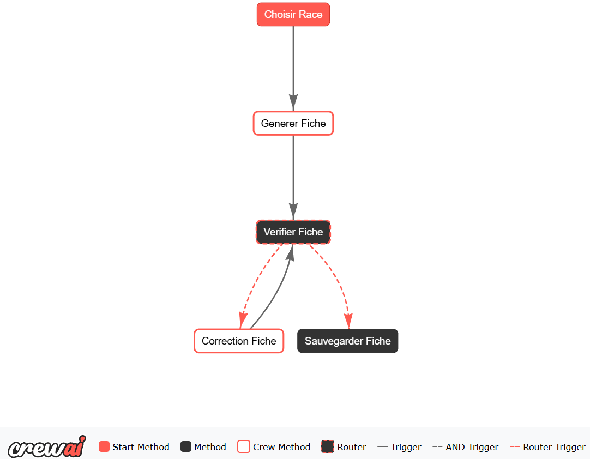
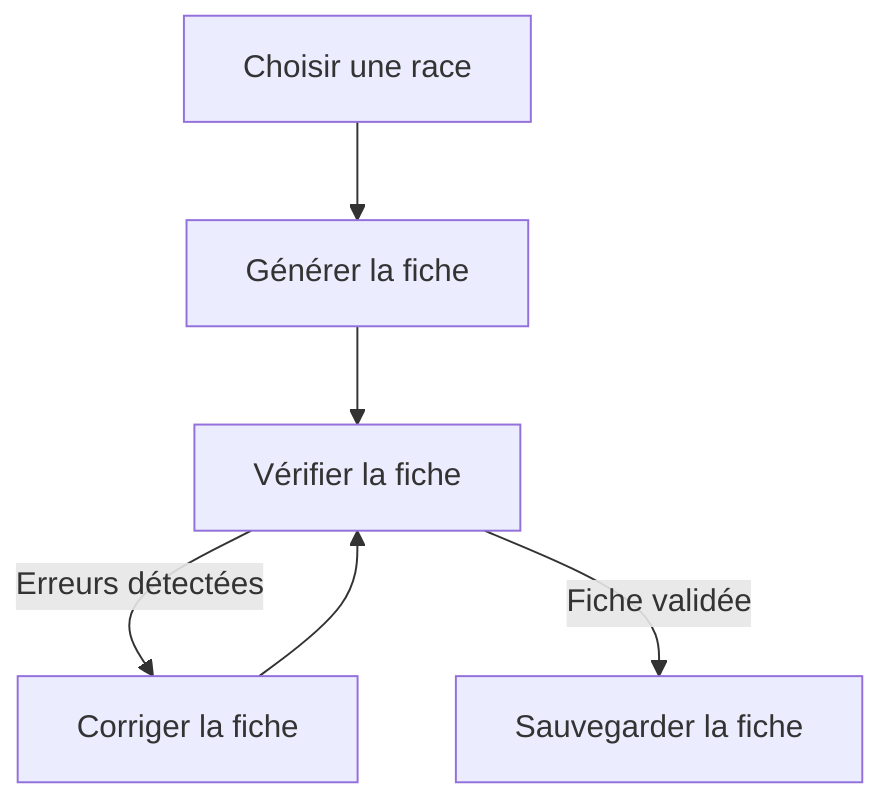

# 🐶 CrewAI Chien Flow - Génération Automatique de Fiches Canines avec CrewAI  

Bienvenue dans **CrewAI Chien Flow**, un projet démontrant l'utilisation avancée de **CrewAI en mode Flow** pour automatiser la **création, vérification et correction de fiches sur les races de chiens**.  

## 🎯 Objectif du projet  

Ce projet met en place un **pipeline intelligent** où des agents IA spécialisés interagissent pour :  
✅ **Générer** une fiche descriptive d'une race de chien 📄  
✅ **Vérifier** la qualité et l'exactitude de la fiche générée 🔍  
✅ **Corriger** les erreurs détectées pour assurer une information fiable ✏️  
✅ **Valider** et **sauvegarder** la fiche finale 💾  

💡 **L'objectif est de montrer comment CrewAI peut être utilisé pour structurer un workflow complexe de manière efficace et automatisée.**  

---

## ⚙️ Technologies utilisées  

🔹 **CrewAI** 🧠 - Framework pour orchestrer des équipes d'agents IA  
🔹 **Python** 🐍 - Langage de programmation principal  
🔹 **Ollama** ⚡ - Modèle IA local optimisé pour la confidentialité et la rapidité  
🔹 **Pydantic** 📏 - Validation des données et structuration des fiches  
🔹 **LangChain (optionnel)** - Pour enrichir l'accès aux sources de données  

---

## 📂 Structure du projet  

```
📂 crewAI-chien-flow/
├── 📂 src/chien_carac/
│   ├── 📂 crews/                    # Contient les différentes équipes d'agents CrewAI
│   │   ├── 📂 chien_crew/           # Équipe responsable de la génération des fiches canines
│   │   │   ├── 📝 chien_crew.py     # Définition des agents et tâches de génération
│   │   │   ├── 📂 config/           # Configuration YAML des agents et tâches de cette équipe
│   │   │   │   ├── 📝 agents.yaml   # Définit l'agent générateur de fiches canines
│   │   │   │   ├── 📝 tasks.yaml    # Définit la tâche de génération de fiche
│   │   ├── 📂 verifier_crew/        # Équipe responsable de la vérification des fiches
│   │   │   ├── 📝 verifier_crew.py  # Définition des agents et tâches de vérification
│   │   │   ├── 📂 config/           # Configuration YAML des agents et tâches de vérification
│   │   │   │   ├── 📝 agents.yaml   # Définit l'agent vérificateur de fiches
│   │   │   │   ├── 📝 tasks.yaml    # Définit la tâche de vérification
│   │   ├── 📂 fix_crew/             # Équipe responsable de la correction des fiches
│   │   │   ├── 📝 fix_crew.py       # Définition des agents et tâches de correction
│   │   │   ├── 📂 config/           # Configuration YAML des agents et tâches de correction
│   │   │   │   ├── 📝 agents.yaml   # Définit l'agent correcteur
│   │   │   │   ├── 📝 tasks.yaml    # Définit la tâche de correction
│   │   ├── 📂 check_race_crew/      # Équipe responsable de la validation de la race de chien
│   │   │   ├── 📝 check_race_crew.py # Définition des agents et tâches de validation de race
│   │   │   ├── 📂 config/           # Configuration YAML des agents et tâches de validation
│   │   │   │   ├── 📝 agents.yaml   # Définit l'agent vérificateur de race
│   │   │   │   ├── 📝 tasks.yaml    # Définit la tâche de validation de race
│   ├── 📂 config/                   # Contient les configurations globales du projet
│   ├── 📝 main.py                   # Point d'entrée du programme et définition du Flow CrewAI
├── 📜 .env                          # Fichier de configuration des modèles IA (Ollama)
├── 📜 README.md                     # Documentation détaillée du projet
```

---

### 🛠️ **Installation et Configuration**  

Cette section vous guide à travers **l’installation complète** du projet **CrewAI Chien Flow**, en suivant un ordre logique et structuré.  

---

## **1️⃣ Cloner le dépôt**  

Commencez par **télécharger** le projet sur votre machine :  

```sh
git clone https://github.com/S8N02000/crewAI-chien-flow.git
cd crewAI-chien-flow
```

---

## **2️⃣ Installer `uv` (Gestionnaire de dépendances CrewAI)**  

[documentation officielle de `CrewAI`](https://docs.crewai.com/installation)

⚠️ **CrewAI utilise `uv` pour gérer les dépendances**, un outil plus rapide et efficace que `pip`.  

📥 **Installation de `uv`** :

- **Sous macOS/Linux** :  
  ```sh
  curl -LsSf https://astral.sh/uv/install.sh | sh
  ```
  Ou avec `wget` :  
  ```sh
  wget -qO- https://astral.sh/uv/install.sh | sh
  ```

- **Sous Windows (PowerShell)** :  
  ```sh
  powershell -ExecutionPolicy ByPass -c "irm https://astral.sh/uv/install.ps1 | iex"
  ```

📖 **Besoin d’aide ?** Consultez la [documentation officielle de `uv`](https://docs.astral.sh/uv/getting-started/installation/).

---

## **3️⃣ Installer CrewAI**  

Une fois `uv` installé, installez CrewAI avec la commande :  
```sh
uv tool install crewai
```

Si vous voyez une **erreur de `PATH`**, ajoutez CrewAI à votre environnement en exécutant :  
```sh
uv tool update-shell
```

💡 **Vérifiez l’installation de CrewAI** :  
```sh
uv tools list
```
✅ Si l’installation a réussi, vous verrez une ligne similaire à :  
```
crewai v0.102.0
- crewai
```

---

## **4️⃣ Installer Ollama et un modèle IA**  

CrewAI utilise **Ollama**, un moteur IA local permettant d’exécuter des modèles **sans dépendre du cloud**.  

📥 **Téléchargez Ollama ici** : [https://ollama.ai](https://ollama.ai)  

Une fois installé, **lancez Ollama** :  
```sh
ollama serve
```

Ensuite, **téléchargez un modèle IA optimisé** :  
```sh
ollama pull llama3.1
```
[Recherche des models](https://ollama.com/search?q=llama3.1)

Choisissez le nombre de paramètres que votre carte graphique peut prendre en charge

📌 **Vous pouvez aussi tester d’autres modèles** en remplaçant `llama3.1` par un autre modèle compatible avec CrewAI.

---

## **5️⃣ Configurer l'environnement**  

Créez un fichier **`.env`** à la racine du projet et ajoutez-y ces paramètres :  

```ini
MODEL=ollama/llama3.1
API_BASE=http://localhost:11434
OTEL_SDK_DISABLED=true
```

✅ **Ce fichier permet à CrewAI de se connecter à Ollama** et d’utiliser le modèle IA local.

---

## **6️⃣ Créer et activer un environnement virtuel**  

📌 **Pourquoi un environnement virtuel ?**  
Cela permet d’isoler les dépendances du projet et d’éviter les conflits avec d’autres programmes installés sur votre machine.  

- **Sous macOS/Linux** :  
  ```sh
  python3 -m venv .venv
  source .venv/bin/activate
  ```

- **Sous Windows (CMD ou PowerShell)** :  
  ```sh
  python -m venv .venv
  .venv\Scripts\activate
  ```

💡 **Si l’environnement virtuel est bien activé**, vous verrez `(venv)` ou `(.venv)` au début de votre terminal.

---

## **7️⃣ Lancer CrewAI Flow**  

Tout est prêt ! Vous pouvez maintenant **exécuter le Flow CrewAI** 🎬  

```sh
crewai flow kickoff
```

📊 **Générer un diagramme du Flow** (utile pour visualiser l’exécution) :  
```sh
crewai flow plot
```



---

## **🎉 Installation réussie !**  

✅ **Vous avez maintenant un environnement CrewAI opérationnel !**  
🔥 **Il ne reste plus qu'à explorer CrewAI Chien Flow et générer des fiches de races de chiens ! 🐶🚀**  

---

## **📌 Récapitulatif rapide des commandes**  

| Étape | macOS/Linux | Windows |
|-------|------------|---------|
| **Cloner le projet** | `git clone ... && cd crewAI-chien-flow` | `git clone ... && cd crewAI-chien-flow` |
| **Installer `uv`** | `curl -LsSf https://astral.sh/uv/install.sh | sh` | `powershell -ExecutionPolicy ByPass -c "irm https://astral.sh/uv/install.ps1 | iex"` |
| **Installer CrewAI** | `uv tool install crewai` | `uv tool install crewai` |
| **Mettre à jour le shell (si erreur `PATH`)** | `uv tool update-shell` | `uv tool update-shell` |
| **Installer Ollama** | `ollama serve` | `ollama serve` |
| **Télécharger un modèle IA** | `ollama pull llama3.1` | `ollama pull llama3.1` |
| **Créer un environnement virtuel** | `python3 -m venv .venv && source .venv/bin/activate` | `python -m venv .venv && .venv\Scripts\activate` |
| **Configurer `.env`** | `echo 'MODEL=ollama/llama3.1\nAPI_BASE=http://localhost:11434\nOTEL_SDK_DISABLED=true' > .env` | Créer `.env` avec le contenu |
| **Lancer CrewAI Flow** | `crewai flow kickoff` | `crewai flow kickoff` |
| **Afficher le Flow** | `crewai flow plot` | `crewai flow plot` |

---

🔥 **Tout est prêt ! Amusez-vous à expérimenter avec CrewAI et l'automatisation des fiches de chiens !** 🐕✨

💡 Ce script **automatisera entièrement** la génération et validation d'une fiche canine.  

---

## 🔍 Fonctionnement du Flow  

Le **Flow CrewAI** est conçu pour orchestrer les différentes étapes :  

1️⃣ **écrire le nom d'une race de chien**  
2️⃣ **Génération automatique** de la fiche descriptive 📝  
3️⃣ **Vérification** de l’exactitude des informations ✅  
4️⃣ **Correction automatique** des erreurs détectées ✏️  
5️⃣ **Validation et sauvegarde** de la fiche finale 💾  

### 📊 **Schéma du Flow**  



---

## 🐶 **Exemple de Fiche Générée**  

```json
{
"race": "Bulldog",
"Features": "Le bulldog est une race de chien compacte et robuste avec un corps court et large, une tête carrée et des oreilles courts. Ils ont une peau épaisse et souple qui leur permet de supporter les longues périodes d'insolation sans se brûler. Les bulldogs sont connus pour leur tempérament gentil et affectueux. Ils sont souvent décrits comme étant « attachés à leur famille ». Cependant, il est important de noter que la peau épaisse des bulldogs peut les rendre plus sensibles aux changements de température et qu'ils peuvent nécessiter une attention spécifique pour maintenir leur hygiène corporelle. En outre, ils ont une vie moyenne comprise entre 8 et 12 ans.",
"Disadvantages": "Les bulldogs sont une race qui souffre de problèmes respiratoires en raison de la forme de leur tête, ce qui peut les rendre vulnérables aux maladies pulmonaires. Ils peuvent également avoir des problèmes de santé liés à leurs problèmes d’obésité et aux problèmes de chaleur. Les bulldogs nécessitent une grande quantité de soins pour maintenir leur peau saine et prévenir les problèmes respiratoires. Il est essentiel de les surveiller régulièrement pour détecter les signes de santé dégradée, tels que la respiration difficile ou l'apnée.",
"Education": "L'éducation des bulldogs nécessite patience, persévérance et une approche positive. Ils sont souvent difficiles à entraîner en raison de leurs problèmes respiratoires et peuvent être tentés de refuser les commandes ou les séances d'entraînement. Cependant, avec l'aide d'un professionnel, ils peuvent apprendre à se comporter et à obéir. Il est important de choisir un entraîneur expérimenté qui comprend les besoins spécifiques des bulldogs. Les séances d'entraînement doivent être courtes et régulières pour éviter la fatigue du chien. Des méthodes d'apprentissage positives telles que la récompense et la prise en compte de l'état émotionnel du chien sont recommandées.",
"Food": "Les bulldogs nécessitent une alimentation équilibrée qui leur permette de maintenir un poids santé. Ils doivent être nourris régulièrement tout au long de la journée pour éviter les problèmes d'obésité. Il est recommandé d'alimenter des aliments spécifiques destinés aux bulldogs, car ils ont des besoins nutritionnels différents des autres races. Les bulldogs nécessitent entre 1 500 et 2 000 kcal/jour en fonction de leur taille, âge et niveau d'activité. Il est essentiel de contrôler leur poids et de veiller à ce qu'ils ne mangent pas trop.",
"Care": "Les bulldogs nécessitent une attention spécifique pour maintenir la propreté de leur peau et éviter l'apparition d'eczéma ou d'autres affections cutanées. Ils doivent être lavés régulièrement, au moins deux fois par semaine. Les bulldogs nécessitent également une attention spécifique pour maintenir la santé de leurs dents en raison de leur épaisse peau qui peut rendre difficile l'accès à leurs gencives. Il est essentiel de les surveiller régulièrement pour détecter les signes de santé dégradée, tels que la respiration difficile ou l'apnée. Des examens périodiques et des vaccinations doivent être effectués régulièrement pour maintenir leur état de santé."
}
```

---

## 🎓 **Apprendre plus sur CrewAI**  

📚 [Documentation CrewAI](https://docs.crewai.com)  
📂 [Exemples de Flows CrewAI](https://github.com/joaomdmoura/crewAI)  

---

## 📜 **Licence**  

Ce projet est sous licence **MIT**.